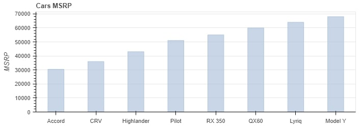
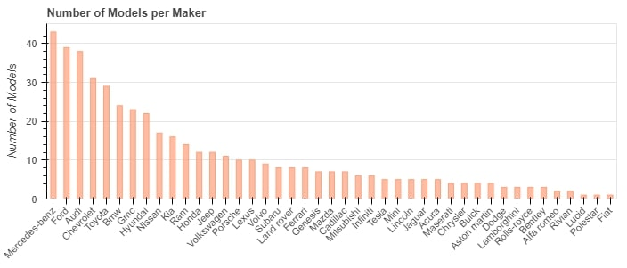
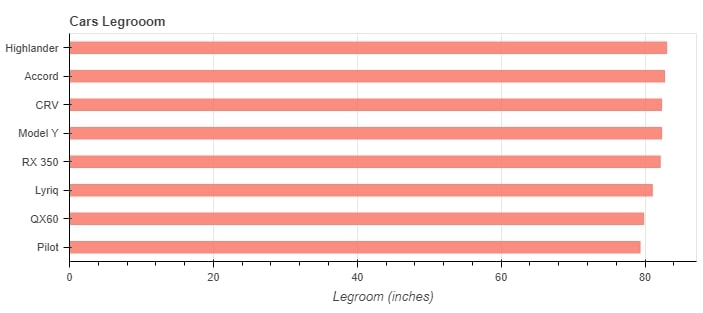
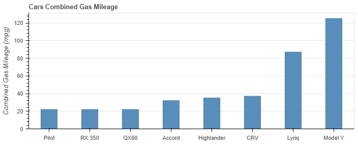

# **Vroom, Vroom...**

### *Project by Gwen Duncan*
 

 
Credit: Oerlive.com
 
 
 
 
**We** get to buy a car! **Me? Me! I get to buy a car!**

Now which car will we/I choose?

This project will serve as an aid in helping my husband and I decide which car to choose based on specs such as gas mileage, price, and amount of legroom. 
I have obtained two datasets. One that I created based on data from [Edmunds.com](https://www.edmunds.com/) called "Specs.xlsx" and another from Abhionlyone's Github repo [US-Car-Models-Data](https://github.com/abhionlyone/us-car-models-data) using the 2022.csv and adding a few makes and models from 2023. This file is "Cars_22-23.csv". 
 

## **Getting the Program to Run**
 

1. Make sure to have a version of Python3 installed on your computer, visit [Python.org](https://www.python.org/downloads/) and download Python for your machine. This project was ran using Python 3.10.1.
2. After you have downloaded Python, clone the repository(repo) from github.
3. Within your cloned repository, it is best practice to setup a virtual environment(venv). This allows you to install any project requirements without interfering with what you currently have installed. To set up the venv, from within the cloned repo folder navigate to the file path line. Here you will type "cmd" into the file path to bring up the command terminal. From there run, "py -m venv env". This will create a folder named "env" within your repo folder. This will house the python venv. Once you have that created, you will need to activate it. Run 
".\env\Scripts\activate" from the command terminal. You will know your venv is active when you see (env) ahead of your directory path. Now your venv is ready to use.
4. From within that directory pip install the requirements.txt file by running "pip install -r requirements.txt". This will make sure you have the necessary packages to run the program. For this program, we will be using these libraries:
- Numpy
- Pandas
- Matplotlib
- Bokeh
5. Now that you have installed the packages and you are in the directory, you can run the program directly from the command terminal by running "Vroom.py" or you can open your favorite IDE (I use VSCode), open the repo folder and run the Vroom.py program. Running the program will output an index.html file. This is where the Bokeh plots will be displayed. Open your favorite web browser (I use Chrome) and drag the index.html file to the web browsers address bar, click enter and this should take you to the visuals.
6. Once you are done with the program, make sure you deactivate your venv. Run "deactivate" from the command terminal with the project directory.
 
 

### Alternatively, you can run the program using **jupyter notebooks**, follow the steps below:
 

1. Clone the repo from github.
2. Once you have cloned the repo, use File Explorer to navigate to the directory folder that contains the repo.
3. Once you have navigated to the folder, from the file path line type "cmd" to bring up the command prompt in that directory.
4. From the command line, run "jupyter notebook", this will open a browser window.
5. From the browser window open "Vroom.ipynb", run this to run the program.
6. Drag the index.html file from the directory into a web browser like Google Chrome's address line to view the visuals/charts.
 
 

## **Requirements Met**
 

This project incorporates the following Code Louisville Data Analysis 2 requirements:
1. Read TWO data files (JSON, CSV, Excel, etc.). 
2. Clean your data and perform a pandas merge with your two data sets, then calculate some new values based on the new data set.
3. Make a visualization with Bokeh. 
4. Utilize a virtual environment and include instructions in your README on how the user should set one up.
5. Annotate your code with markdown cells in Jupyter Notebook, write clear code comments, and have a well-written README.md.

The final plots break down our Top 8 car choices based on combined gas mileage, legrooom and the MSRP. I also displayed a plot to show the number of models per make. Here we can see that Mercedes has the most models. 

After all this, we still do not have a clear winner and will use the test drive to solidify our choice. 
 
 

**Plot 1:**
 

 

**Plot 2:**
 

 

**Plot 3:**
 

 

**Plot 4:**
 

Credits:
 
Images: shutterstock.com, oerlive.com
 
Data: Abhionlyone's Github, Edmunds.com